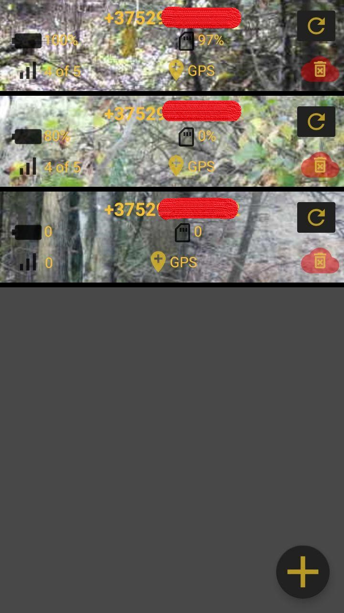
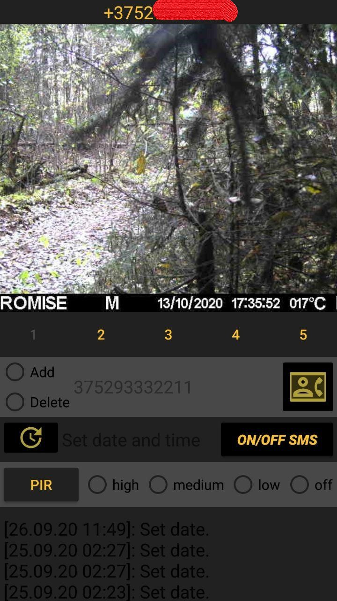

# CameraTrapManager
CameraTrapManager. 
An application that makes working with camera traps easier.
# MMS and SMS receivers 
https://github.com/pavel0001/CameraTrapManager/blob/master/app/src/main/java/com/example/cameratrapmanager/SmsReceiver.java
Main part of this application this sms and mms reciever's, who looks at the incoming message and finds messages from our camera trap, which has been added to the application.
At MainActivity has floating action button for added new camera trap.
# Google map API
In the procces of adding a new camera trap, users can indicate location on the map (from Google map API) where the trap is.
# Room database
All data about added camera trap save at device in Room database
# Recycler View & View Pager 2
The main screen is recycler view where each elements is clicable. After touch elements from main frame's recycler view, user move to individual_cameratrap_activity where we can see last 10 images (they contains in view pager2) from camera and send command to her for set preferences.
......(readme will be updating)

